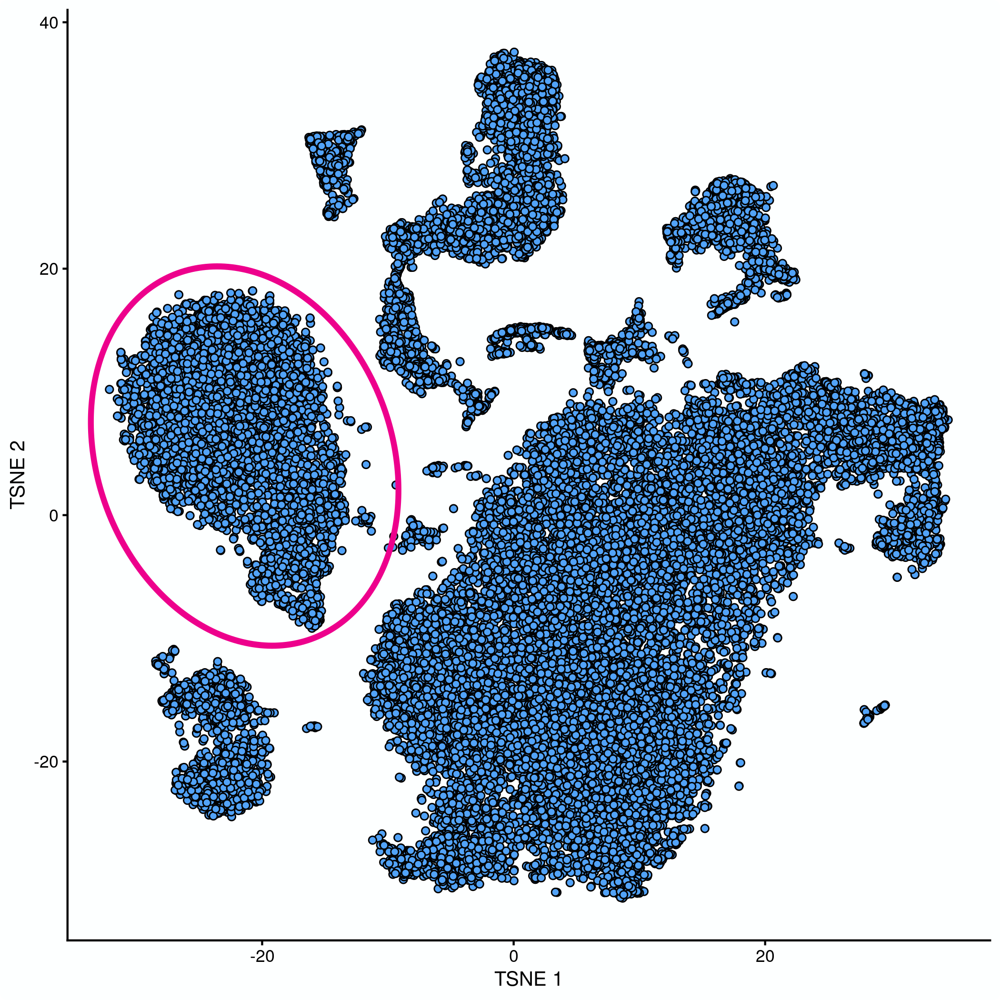

```{r setup, warning=FALSE, message=FALSE, include=FALSE}
library(scater) # scRnaSeq QC
library(scran) # scRnaSeq normalisation
library(bluster) # scRnaSeq clustering
library(cluster) # for silhouette
library(igraph) # for graph-based clustering and plotting networks
library(pheatmap) # for heatmap plotting
library(patchwork) # to combine plots
library(tidyverse) # data wrangling and plotting (ggplot2)
library(DT) # for printing nice data tables from data.frames

knitr::opts_chunk$set(cache=FALSE) # This prevents RStudio from caching the results when you render the report
```

# Load data

Cluster sweep has already been run on the QC'd, filtered, normalised and batch
corrected Caron data. Please see the script *ClusterSweep.R* for details.

Here the `clusterSweep` results object, cluster behaviour metrics and the SCE
object containing corrected data and the clusters are loaded.

```{r load_data}
out <- readRDS("../Robjects/clusterSweep.out.rds")
df <- read_tsv("../Robjects/clusterSweep.metrics_df.tsv")
sce <- readRDS("../Robjects/clusterSweep.sce.rds")
```

Cluster sweep was run with the following combinations of parameters:

```{r tableOfparameters}
out$parameters %>%
  as.data.frame() %>% 
  select(`Cluster function`=cluster.fun, k) %>% 
  rownames_to_column("colData column") %>% 
  datatable(rownames=FALSE)
```

# Assess cluster behaviour metrics

We will consider the number of clusters, the mean silhouette width and the sum
of the within-cluster sum of squares as an initial assessment of cluster
behaviour. To assess the behaviour of the clusterings we can plot these metrics
against the *k*.

```{r plotMetrics, fig.width=12}
nclPlot <- ggplot(df, aes(x = k, y = num.clusters)) + 
                  geom_line(aes(colour=cluster.fun), lwd=2)

silPlot <- ggplot(df, aes(x = k, y = silhouette)) + 
                  geom_line(aes(colour=cluster.fun), lwd=2)

wcssPlot <- ggplot(df, aes(x = k, y = wcss)) + 
                  geom_line(aes(colour=cluster.fun), lwd=2)

nclPlot + silPlot + wcssPlot + plot_layout(guides = "collect")
```

```{r}
df %>%
  filter(num.clusters>=10 & num.clusters<=15)
```


# Visualise the clusters using tSNE plots

We can now visualise our selected clusterings of interest on tSNE plots.

```{r}
plotTSNE(sce, colour_by = "k.60_cluster.fun.leiden")
plotTSNE(sce, colour_by = "k.15_cluster.fun.louvain")
plotTSNE(sce, colour_by = "k.20_cluster.fun.louvain")
plotTSNE(sce, colour_by = "k.25_cluster.fun.louvain")
```

```{r}
table(sce$k.60_cluster.fun.leiden)
table(sce$k.15_cluster.fun.louvain)
table(sce$k.20_cluster.fun.louvain)
table(sce$k.25_cluster.fun.louvain)
```
# Cluster-wise silhouette widths

```{r} 
plotSilhouette <- function(clusters, plotTitle){
  approxSilhouette(reducedDim(sce, "corrected"), 
                                clusters=clusters) %>% 
  as.data.frame() %>% 
  mutate(closestCluster = ifelse(width > 0, cluster, other) %>% factor()) %>%
  ggplot(aes(x=cluster, y=width, colour=closestCluster)) +
    ggbeeswarm::geom_quasirandom(method="smiley") +
    ggtitle(plotTitle)
}
```

## Leiden k = 60

```{r}
plotSilhouette(sce$k.60_cluster.fun.leiden, "Leiden k=60")
plotSilhouette(sce$k.15_cluster.fun.louvain, "Louvain k=15")
plotSilhouette(sce$k.20_cluster.fun.louvain, "Louvain k=20")
plotSilhouette(sce$k.25_cluster.fun.louvain, "Louvain k=25")
```


# B Cell marker genes

```{r}
rownames(sce) <- uniquifyFeatureNames(rowData(sce)$ID, rowData(sce)$Symbol)
```

```{r fig.height=12, fig.width=14}
p1 <- plotTSNE(sce, by_exprs_values = "reconstructed",
               colour_by = "MS4A1",
               text_by = "k.60_cluster.fun.leiden")
p2 <- plotTSNE(sce, by_exprs_values = "reconstructed"
               , colour_by = "CD79A",
               text_by = "k.60_cluster.fun.leiden")
p3 <- plotTSNE(sce, by_exprs_values = "reconstructed"
               , colour_by = "TNFRSF13C",
               text_by = "k.60_cluster.fun.leiden")
p4 <- plotTSNE(sce, by_exprs_values = "reconstructed"
               , colour_by = "BCL6",
               text_by = "k.60_cluster.fun.leiden")
(p1 + p2) / (p3 + p4)
```

# A look at the three louvain clusterings with Cluster Tree

We can look at how cells move between clusters using `clustree`

```{r}
combined <- cbind(k.15=sce$k.15_cluster.fun.louvain,
                  k.20=sce$k.20_cluster.fun.louvain,
                  k.25=sce$k.25_cluster.fun.louvain)

library(clustree)
set.seed(1111)
clustree(combined, prefix="k.", edge_arrow=FALSE)
```

# Comparing two sets of clusters

```{r fig.width=6, fig.height=4}
jacc.mat <- linkClustersMatrix(sce$k.20_cluster.fun.louvain, sce$k.60_cluster.fun.leiden)
rownames(jacc.mat) <- paste("Louvain", rownames(jacc.mat))
colnames(jacc.mat) <- paste("Leiden", colnames(jacc.mat))
pheatmap(jacc.mat, color=viridis::viridis(100), cluster_cols=FALSE, cluster_rows=FALSE)
```

```{r}
plotTSNE(sce, 
         colour_by = "k.50_cluster.fun.leiden",
         text_by = "k.50_cluster.fun.leiden")
```

```{r}
plotSilhouette(sce$k.50_cluster.fun.leiden, "Leiden k=50")
```

```{r, eval=FALSE}
out.leiden <- clusterSweep(reducedDim(sce, "corrected"),
                    BLUSPARAM = NNGraphParam(),
                    k = as.integer(51:59),
                    cluster.fun = "leiden",
                    BPPARAM=BiocParallel::MulticoreParam(5))
saveRDS(out.leiden, "../Robjects/clusterSweep.out.leiden.rds")
```

```{r}
out.leiden <- readRDS("../Robjects/clusterSweep.out.leiden.rds")
colData(sce) <- cbind(colData(sce), DataFrame(out.leiden$clusters))
```

```{r}
plotTSNE(sce, colour_by = "k.52_cluster.fun.leiden")
plotTSNE(sce, colour_by = "k.54_cluster.fun.leiden")
plotTSNE(sce, colour_by = "k.56_cluster.fun.leiden")
plotTSNE(sce, colour_by = "k.57_cluster.fun.leiden")
plotTSNE(sce, colour_by = "k.58_cluster.fun.leiden")
```

I am going to move forward with Leiden & k=57 for now.


```{r}
colLabels(sce) <- sce$k.57_cluster.fun.leiden
```

# Cluster marker gene detection

First we need to load the uncorrected data set. We'll start from the object 
`Caron_filtered_genes.rds`. This contains all of the samples from the complete
data set, so we'll to need to subset that to the just the 7 Caron samples we're
using here. Also, there are additional genes - these were filtered out after 
subsetting to the 7 samples based on expression - so we'll need to subset the
genes as well.

```{r eval=FALSE}
uncorrected <- readRDS("../Robjects/Caron_filtered_genes.rds")

# subset samples and genes to match current data set
samples <- colData(uncorrected)$Sample %in% colData(sce)$SampleName
genes <- rowData(sce)$ID

uncorrected <- uncorrected[genes, samples]

# Normalisation
clust <- quickCluster(uncorrected)
uncorrected <- computePooledFactors(uncorrected, cluster=clust, min.mean=0.1)
uncorrected <- logNormCounts(uncorrected)

colnames(colData(uncorrected))[1] <- "SampleName"

saveRDS(uncorrected, "../Robjects/LogNormalised.AllCells.Rds")
```

```{r}
uncorrected <- readRDS("../Robjects/LogNormalised.AllCells.Rds")
```


We'll switch the row names to be the gene symbols.

```{r}
rownames(uncorrected) <- uniquifyFeatureNames(rowData(uncorrected)$ID,
                                              rowData(uncorrected)$Symbol)
```

Just check everything matches.

```{r}
all(colnames(sce)==colnames(uncorrected))
all(rownames(sce)==rownames(uncorrected))
```

Add the clusters and then run `scoreMarkers`.

```{r}
colLabels(uncorrected) <- colLabels(sce)
markers <- scoreMarkers(uncorrected, 
                        groups = factor(uncorrected$label), 
                        block =uncorrected$SampleName)
```

I asked you to identify this cluster:



Which is made up of clusters 3 and 7.

```{r}
plotTSNE(sce, colour_by = "label", text_by = "label")
```

Let's have a look at the top marker genes for cluster 3:

```{r}
topRanked <- markers[["3"]] %>%
  as.data.frame() %>% 
  select(contains("cohen")) %>% 
  filter(rank.logFC.cohen <= 5) %>% 
  arrange(desc(mean.logFC.cohen))
topRanked
```

There's lots of ribosomal genes at the top of this list. Let's check the
expression of a few:

```{r}
plotExpression(uncorrected, 
               features = "RPS27", 
               x = "label")
plotExpression(uncorrected, 
               features = "RPL34", 
               x = "label")
plotExpression(uncorrected, 
               features = "RPL21", 
               x = "label")
```

These aren't really going to be useful as marker genes.

On the other hand, further down we do have **CD3D**, **CD3E** and **TRAC**,
which are T-cell markers, and **IL32**, which is an indicator of T-cell
activation.

Let's take a look at these:

```{r fig.height=12, fig.width=14}
p1 <- plotTSNE(sce, by_exprs_values = "reconstructed",
               colour_by = "CD3D",
               text_by = "label")
p2 <- plotTSNE(sce, by_exprs_values = "reconstructed",
               colour_by = "CD3E",
               text_by = "label")
p3 <- plotTSNE(sce, by_exprs_values = "reconstructed",
               colour_by = "TRAC",
               text_by = "label")
p4 <- plotTSNE(sce, by_exprs_values = "reconstructed",
               colour_by = "IL32",
               text_by = "label")
(p1 + p2) / (p3 + p4) 
```

```{r fig.height=8, fig.width=14}
p1 <- plotExpression(uncorrected, 
               features = "CD3D", 
               x = "label")
p2 <- plotExpression(uncorrected, 
               features = "CD3E", 
               x = "label")
p3 <- plotExpression(uncorrected, 
               features = "TRAC", 
               x = "label")
p4 <- plotExpression(uncorrected, 
               features = "IL32", 
               x = "label")
(p1 + p2) / (p3 + p4) 
```

Let's take look at cluster 7's marker genes.

```{r}
topRanked <- markers[["7"]] %>%
  as.data.frame() %>% 
  select(contains("cohen")) %>% 
  filter(rank.logFC.cohen <= 5) %>% 
  arrange(desc(mean.logFC.cohen))
topRanked
```

**IL32**, **NKG7**, **GZMA** and **CD69** might suggest that these are activated
T-cells.

```{r fig.height=12, fig.width=14}
p1 <- plotTSNE(sce, by_exprs_values = "reconstructed",
               colour_by = "IL32",
               text_by = "label")

p2 <- plotTSNE(sce, by_exprs_values = "reconstructed",
               colour_by = "NKG7",
               text_by = "label")
p3 <- plotTSNE(sce, by_exprs_values = "reconstructed",
               colour_by = "GZMA",
               text_by = "label")
p4 <- plotTSNE(sce, by_exprs_values = "reconstructed",
               colour_by = "CD69",
               text_by = "label")
(p1 + p2) / (p3 + p4)
```

## Session information

<details>
```{r}
sessionInfo()
```
</details>
